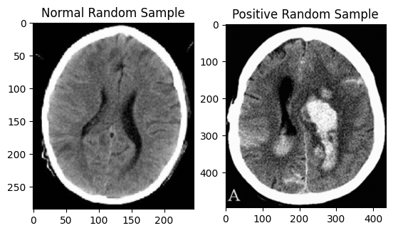

# Brain Hemorrhage and Stroke Diagnosis System

## Overview

This project combines Convolutional Neural Networks (CNN) and Artificial Neural Networks (ANN) to swiftly and accurately diagnose brain hemorrhage and stroke emergencies. Following diagnosis, an email containing the results is promptly dispatched to the hospital's internal branch. The system boasts a user-friendly GUI for both PC and mobile applications, ensuring seamless connectivity. Emphasizing rapid responses and high accuracy, the project significantly enhances emergency medical care for patients experiencing brain hemorrhage and stroke incidents.

## Features

- **CNN and ANN Integration:** The system leverages the power of Convolutional Neural Networks and Artificial Neural Networks for efficient diagnosis.
- **Email Notification:** Results of the diagnosis are automatically sent via email to the hospital's internal branch for immediate action.
- **User-Friendly GUI:** The system is equipped with a graphical user interface that is intuitive and accessible on both PC and mobile platforms.
- **Swift and Accurate Diagnosis:** With a focus on rapid responses and high accuracy, the project aims to enhance emergency medical care for patients experiencing brain hemorrhage and stroke incidents.

## Sample input data

## User Graphical Interface

## Mobile App Design

## Result Reports

## System Overview

